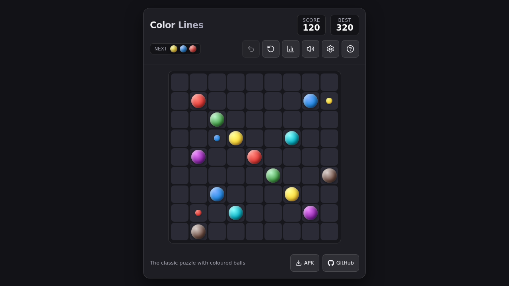
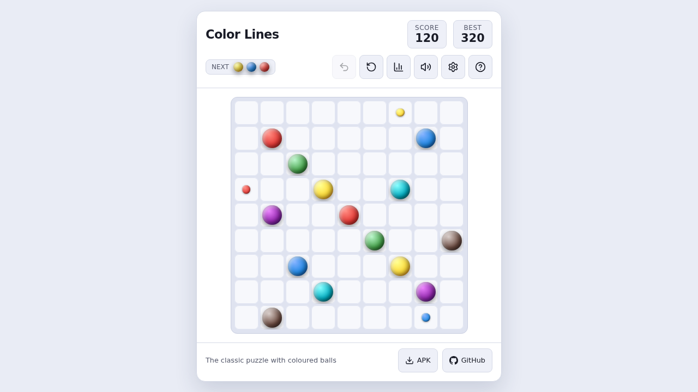
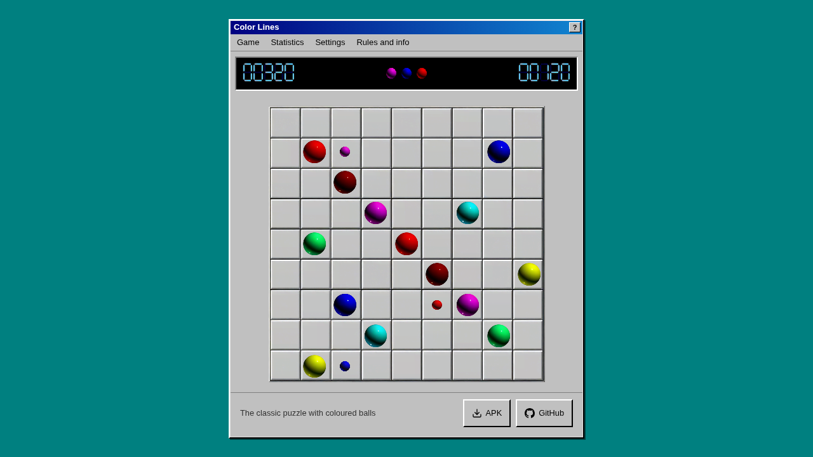
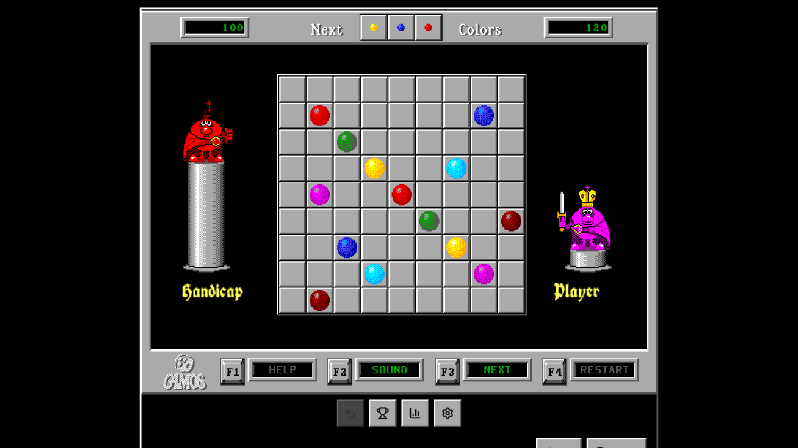

# Color Lines

[](https://github.com/Basil-AS/color-lines-98/actions/workflows/web-ci.yml)
[](https://github.com/Basil-AS/color-lines-98/actions/workflows/android-ci.yml)
[](LICENSE)

[Русская версия](README.ru.md)

**Color Lines** (also known as Lines 98) is a modern port of the classic puzzle: a web version that runs in any browser
and a native Android app, sharing one rule set.

- **Play in the browser:** <https://basil-as.github.io/color-lines-98/> (installable as an app, works offline)
- **Android app:** `ColorLines-<version>.apk` on the [latest release](https://github.com/Basil-AS/color-lines-98/releases/latest)
  (application id `io.github.basil_as.basillines`); the direct link to the newest APK is <https://github.com/Basil-AS/color-lines-98/releases/latest/download/ColorLines.apk>

## Features

- **Rules:** 9×9 board, 7 colours, 3 new balls per turn, lines of 5 or more clear (horizontal, vertical, diagonal),
  clearing a line is a free turn, scoring `2L² − 20L + 60`, undo.
- **Spawn preview:** small balls show on the board where the next balls will appear (can be switched off).
- **Modes** (same on the web and Android): *Classic*, *Easy* (5 colours), *Blitz* (3 minutes) and the *Daily challenge*
  (everyone gets the same start each day, on both platforms). Starting a game while another one is in progress warns
  that it will be counted as unfinished.
- **Goals that adapt:** three daily goals derived from your own recent games (score, longest line, efficiency, beat your
  previous best), with bonus XP and a goal streak, so they stay a fair challenge as you improve.
- **Hint:** marks a ball and where to put it (a clearing move if there is one), three per game.
- **Twelve looks** (web and Android), each with its own sound voice, remembered between launches:
  - *Modern dark*, *Modern light*, *Material*, *Neon*, *Synthwave*, *Ocean* and *Paper*: different colours, board and
    instrument (soft sine, bell, marimba, arcade square, saw, glass, wood block);
  - *Game Boy (1989)* (four greens, chip sound) and *Amber terminal* (phosphor orange, teletype beeps), both shape-coded;
  - *High contrast*: white outlines, every colour also has its own shape;
  - *Lines 98 (Windows)*: grey window chrome, the original bevelled board, red LED digits, the original sprites and sounds;
  - *Color Lines 1992 (DOS)*: **the original screen from `lines.lib`**, drawn with the original sprites: the red king on
    his pillar, the magenta pretender who takes the crown when you beat the king, LCD scores, `F1`–`F4` buttons and
    keys, the original Help window, a Top Ten table, PC-speaker sounds. See [`docs/ORIGINALS.md`](docs/ORIGINALS.md).
- **Progress and analysis:** levels with titles, 18 achievements, day streaks, personal records, active play time, the
  full history (up to 1000 games) and an analysis: trend against your previous games, games per day, score
  distribution, best weekdays, efficiency (points per move), record progression and the games left to the next level.
- **English and Russian**, picked automatically from the browser or system language (web: also switchable in Settings;
  Android: Auto / English / Русский inside the game).
- **Everywhere:** responsive layout for phones, tablets and desktops (portrait and landscape), keyboard play and screen
  reader labels on the web, edge-to-edge with system-bar insets on Android, your game resumes after a restart.

> The 1992 look uses the original artwork extracted from the game archive and the Windows look uses artwork and sounds
> from a Lines 98 clone; see the licensing note in [`docs/ORIGINALS.md`](docs/ORIGINALS.md).

## Install as an app (PWA)

| Platform | How |
|---|---|
| Android, Windows, macOS/Linux (Chrome, Edge) | press **Install** in the game (or the browser's install icon) |
| iPhone and iPad (Safari) | Share, then **Add to Home Screen** (the game explains it) |
| macOS (Safari) | File, then **Add to Dock** |

After the first visit the game runs offline.

## Gallery

| Modern dark | Modern light |
|---|---|
|  |  |
| **Lines 98 (Windows)** | **Color Lines 1992 (DOS)** |
|  |  |

## Repository layout

```
├── src/                 # Web app (React 19 + TypeScript)
│   ├── engine/          # Game rules (board, path finding, lines, engine)
│   ├── dos/             # The 1992 screen: sprites, scene, Top Ten, canvas renderer
│   ├── insights.ts      # Analysis of the recorded games
│   ├── pwa/             # Install button logic
│   ├── progress.ts      # Levels, achievements, streaks
│   ├── stats.ts         # Game history and records
│   ├── i18n.ts          # English/Russian texts (also the source of the Android strings)
│   └── components/      # Dialogs
├── tests/               # Vitest: rules, storage, i18n, progress, UI (Testing Library)
├── android/
│   ├── core-engine/     # Pure Kotlin rules, progress and save format (no Android dependencies)
│   └── app/             # Jetpack Compose UI; Robolectric UI tests in src/test
├── scripts/             # Agent tooling and gen-android-strings.mjs
└── .github/workflows/   # CI, Pages deploy, Android CI, release
```

## Development

### Web
```bash
npm install
npm test            # Vitest (rules, storage, i18n, progress, sounds, full UI flows)
npm run e2e         # Playwright in a real browser (layout of every look, offline PWA, the 1992 screen)
npm run lint        # oxlint
npm run typecheck   # TypeScript
npm run build       # production build in dist/
npm run dev         # local dev server
```

### Android
```bash
cd android
./gradlew :core-engine:test    # pure Kotlin unit tests
./gradlew testDebugUnitTest    # engine + Compose UI tests on the JVM (Robolectric, no emulator needed)
./gradlew assembleDebug        # debug APK
./gradlew assembleRelease      # release APK (signed with the debug key unless you configure your own)
```

Android strings are generated from `src/i18n.ts`; after changing texts run
`node --experimental-strip-types scripts/gen-android-strings.mjs` (CI runs it with `--check`).

## Releases

Releases are automatic: when a pull request is merged to `main` and `package.json` and `versionName` in
`android/app/build.gradle.kts` hold a version without a release, the pipeline tests everything and publishes the
signed `ColorLines-X.Y.Z.apk`, `ColorLines-X.Y.Z-web.zip` and `SHA256SUMS.txt`. Every push to `main` deploys the web app
to GitHub Pages.

## Credits

Color Lines (1992) by Gamos: Oleg Demin, Gennady Denisov, Igor Ivkin. A comparison of twelve implementations is in [`docs/COMPARISON.md`](docs/COMPARISON.md) ([по-русски](docs/COMPARISON.ru.md)).

## License

MIT
